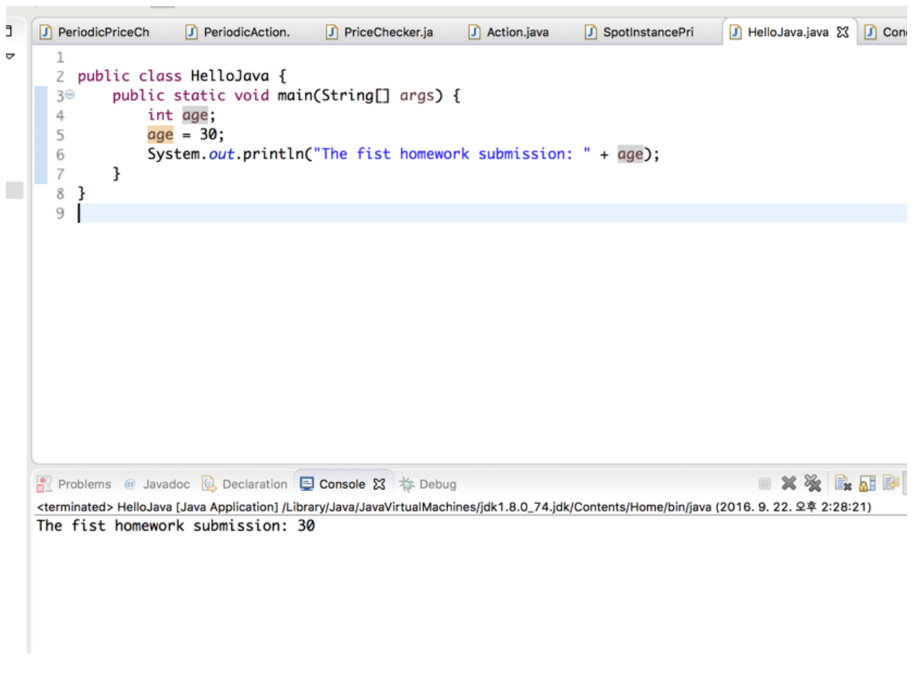

# The link to the homework detail - [click](https://docs.google.com/document/d/1LRj5iH6oyDL_a1-S1OgzFDKXEHEk5q9Y4D8i08_6gnE/edit?usp=sharing)

* 제출할 것들
  * 소스코드 3가지 (StudentInfo.java, BankInterest.java, SizeCalculator.java)
  * 실행화면 (코드와 콘솔 부분 스크린샷 포함) 첨부
  * 
